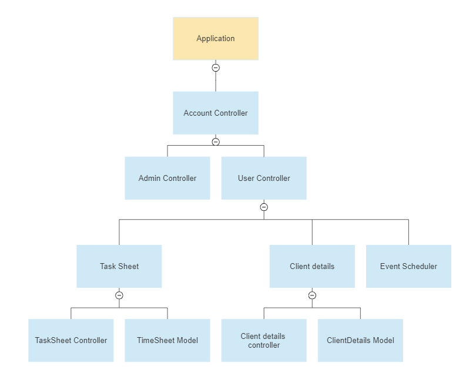

# ClientMSystem

This repository contains **Client Management System** . The Project runs on ASP.NET Core 6.0. This follows the Model-View-Controller (MVC) Pattern.

## Project Architecture

## Documentation

Admin can assign tasks to clients and edit their information.
After completing admin tasks, clients can mark their tasks as completed. He can also make changes to certain details. When a client task is completed, the admin will receive a task sheet detailing which task was completed in mail containing pdf.

### Controllers

- Account
- Admin
- Client Details
- Email
- Home
- Pdf
- Task Sheet

### Models

- Admin
- Client
- EmailDto
- Signup
- Time Sheet

### Packages used here 

- IronPdf
- EntityFrameworkCore
- MailKit
- MimeKit
- RestSharp
